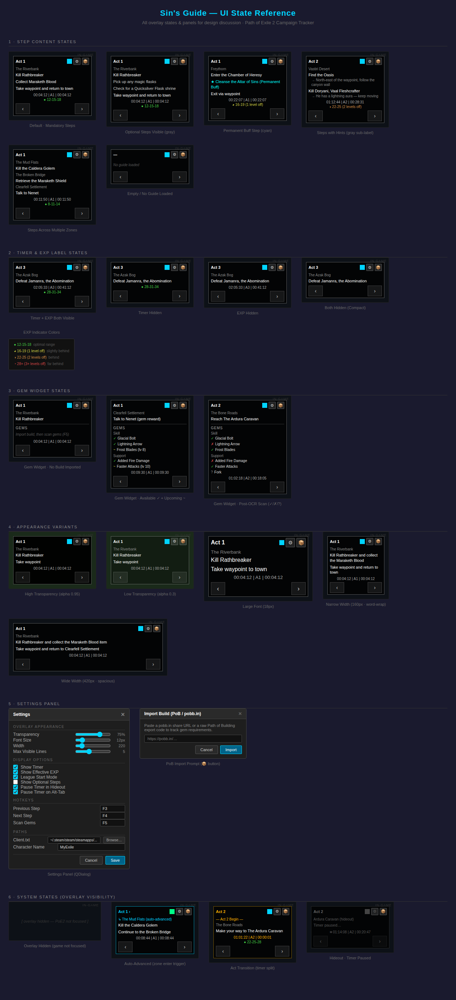

# Sin's Guide

A Path of Exile 2 campaign tracker and overlay for Linux, inspired by Lailloken's Exile-UI Act Tracker.

Tracks your campaign progress, provides step-by-step zone-level guidance, manages gem requirements from PoB imports, and shows real-time effective EXP — all in a transparent draggable overlay that appears over the game window.

## UI Overview



*The overlay in various states: step guidance, gem tracking, settings panel, and PoB import prompt.*

## Features

| Feature | Description |
|---------|-------------|
| **Campaign Guide** | Step-by-step leveling guide for all 7 acts, with zone-aware filtering |
| **Zone-Based View** | Shows only steps for your current zone + next zone preview |
| **Campaign Timer** | Track act completion times with CSV export |
| **Effective EXP** | Real-time level vs zone comparison using the Mobalytics formula |
| **PoB Import** | Import builds from PoB/pobb.in URLs for gem requirement tracking |
| **Gem Scanner** | OCR-based gem panel scanning with fuzzy name matching against the gem database |
| **Gem Widget** | Shows available, missing, upcoming, and unknown gems grouped by type (skill/spirit/support) |
| **Conditional Engine** | Toggle league-start mode, optional steps, and permanent buff tracking |
| **Auto-Advance** | Automatically advances guide steps based on zone transitions detected from Client.txt |
| **Settings Panel** | Adjust transparency, font size, overlay width, hotkeys, and display toggles |
| **X11 Window Tracking** | Auto-hides when game is not focused; tracks focus via xprop and xlib |

## Requirements

- **Python 3.12+**
- **Linux with X11** (XWayland supported for PoE2 Proton)
- **Path of Exile 2** via Steam/Proton
- **Tesseract OCR** (`tesseract-ocr` package) — required for gem scanning

## Installation

```bash
# Clone the repo
git clone https://github.com/jay9297/SinsGuide.git
cd SinsGuide

# Set up virtual environment
python -m venv venv
source venv/bin/activate

# Install dependencies
pip install -r sin_guide/requirements.txt

# Install Tesseract OCR (for gem scanning)
# Debian/Ubuntu:
sudo apt install tesseract-ocr
# Fedora:
sudo dnf install tesseract
# Arch:
sudo pacman -S tesseract
```

## Usage

```bash
python main.py
```

The overlay will:
1. Auto-discover your Steam Proton prefix for PoE2 (Client.txt)
2. Load the campaign guide
3. Show the overlay window (initially hidden until PoE2 is detected)
4. Track progress via Client.txt log parsing
5. Advance guide steps automatically as you change zones

### Gem Tracking Workflow

1. **Import Build**: Click the package icon (📦) in the overlay header, or press the import hotkey. Paste a pobb.in URL or PoB XML pastebin.
2. **Scan Gems** (F5): The overlay captures a screenshot of your gem panel, runs OCR, and matches extracted names against the gem database using fuzzy matching.
3. **Review**: The gem widget shows which gems you have (✓) and which are missing (✗) from your build.

## Default Hotkeys

| Key | Action |
|-----|--------|
| **F3** | Previous guide step |
| **F4** | Next guide step |
| **F5** | Scan gems (OCR) |

## Settings

Right-click the overlay or edit `~/.config/sin_guide/config.json`.

### Available Settings

| Setting | Description | Default |
|---------|-------------|---------|
| Transparency | Overlay background opacity | 75% |
| Font Size | Step description font size | 12px |
| Width | Overlay width | 220px |
| Max Visible Lines | Steps shown at once | 5 |
| Show Timer | Toggle campaign timer display | On |
| Show Effective EXP | Toggle EXP indicator display | On |
| League Start Mode | Hide premium/stash-tab steps | Off |
| Show Optional Steps | Display optional objectives | Off |
| Pause Timer in Hideout | Stop timer in town/hideout zones | On |
| Pause Timer on Alt-Tab | Stop timer when game unfocused | On |

## Architecture

```
sin_guide/
├── main.py                 # Entry point — app lifecycle, overlay spawning
├── config/
│   ├── defaults.py         # Default configuration values
│   └── manager.py          # Config manager with file-watch hot-reload
├── core/
│   ├── guide_engine.py     # Conditional step filtering (league-start, optional)
│   ├── log_parser.py       # Client.txt real-time event parser
│   ├── timer.py            # Campaign timer with CSV export
│   ├── exp_calculator.py   # Mobalytics EXP formula implementation
│   ├── gem_cutter.py       # Gem availability intersection & build matching
│   └── gem_ocr.py          # Tesseract OCR with cropping, preprocessing, fuzzy matching
├── data/
│   ├── gems/
│   │   └── poe2_gems.json  # 280+ gem database (skill/spirit/support)
│   ├── guides/
│   │   ├── poe2_campaign.json  # 281-step campaign guide (acts 1-7)
│   │   └── generate_guide.py   # Guide data generator
│   └── zones.json          # 60+ zone-to-level mappings for EXP calc
├── overlay/
│   ├── main_window.py      # PySide6 overlay window (431 lines)
│   ├── gem_widget.py       # Gem availability display with type grouping
│   ├── step_renderer.py    # Guide step rendering logic (extracted)
│   ├── settings_panel.py   # Settings QDialog
│   └── window_tracker.py   # X11 window focus tracking
└── utils/
    ├── steam_discovery.py  # Robust Steam Proton prefix auto-discovery (VDF parser)
    └── pob_parser.py       # PoB/pobb.in XML import parser

tests/
├── test_gem_cutter.py      # Gem intersection & level comparison
├── test_gem_ocr.py         # OCR preprocessing & fuzzy matching
├── test_gem_widget.py      # Widget rendering states
├── test_guide_engine.py    # Guide filtering logic
├── test_overlay_behavior.py # Zone mapping & step advance
├── test_pob_parser.py      # PoB XML parsing (regex, level extraction)
├── test_steam_paths.py     # VDF parser & Proton prefix discovery
└── visual/
    ├── test_gem_widget_states.py  # Visual regression (gem states)
    ├── test_overlay_states.py     # Visual regression (overlay states)
    └── snapshots/                 # 20+ baseline PNGs
```

## Technical Stack

- **UI**: PySide6 (Qt for Python) — transparent overlay with configurable compositing
- **OCR**: Tesseract via pytesseract — with PIL cropping, grayscale threshold, 2x upscaling
- **Fuzzy Matching**: `difflib.get_close_matches` — Levenshtein-adjacent matching at ≥80% threshold
- **Log Parsing**: Real-time Client.txt tailing with regex event extraction
- **Window Tracking**: python-xlib + xprop subprocess for X11 focus detection
- **Steam Discovery**: Custom VDF parser for Steam library folders & Proton prefixes

## Project Status

- **100/100 tests passing**
- Campaign guide complete for all 7 acts
- Gem tracking with OCR, fuzzy matching, and type grouping
- Robust Proton prefix auto-discovery
- Visual regression testing with 20+ baseline snapshots

## License

MIT
